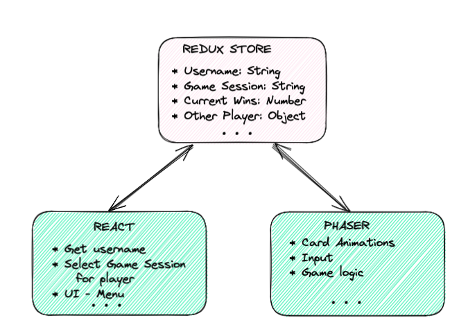

## Fantasy Match

<!--  add a link to the deploying heading -->

[How to deploy](#deploying)
[The project](#the-project)
[Data flow](#data-flow)

### The project

The game is a simple match game. The user has to match the cards by clicking on them.

## Front End Stack

- [Vite](https://vitejs.dev/)
- [React](https://reactjs.org/)
- [Typescript](https://www.typescriptlang.org/)
- [Phaser](https://phaser.io/)
- [React-Redux](https://react-redux.js.org/)

For this project, I wanted to use React for the UI and Phaser for all the game logic. The biggest
challenge was to get the two to work together. I wanted to learn as much as possible without
re-inventing the wheel. I could have, for example, used the [react-phaser-fiber](https://www.npmjs.com/package/react-phaser-fiber)
package, but I wanted to challenge myself and learn how to do it myself.

I did not have a lot of experience with Phaser or React, so I had to do a lot of research. There
are a lot of resources online for React, Phaser is a different story. I mostly read the documentation
and looked at the examples on their website.

#### Data flow

I had a pretty clear idea of how the data was going to flow through the app. I knew the React side of the app
would be handling the UI, User input, displaying player scores, etc. Phaser would handle the game logic, detect
when a player scores, and send data to the server. Both React and Phaser would receive and send data to the server.

[](./react-redux-2.png)

## Back End Stack

- [Node](https://nodejs.org/en/)
- [Express](https://expressjs.com/)
- [Socket.io](https://socket.io/)

### deploying

```bash
# Commit all changes
$ git add .;commit -m "message ..."; git push -u origin main
# Build:
$ yarn run build
# Add dist folder:
$ git add dist -f
# Build the vite project
$ yarn run build
# Deploy using gh-pages
$ git subtree push --prefix dist origin gh-pages
```
